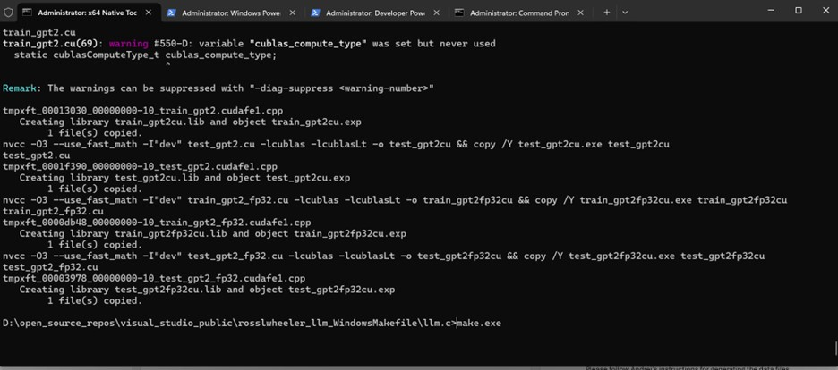
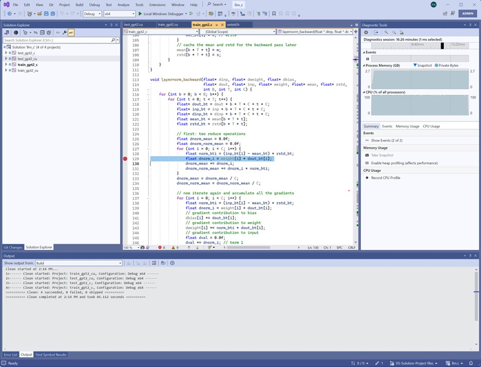
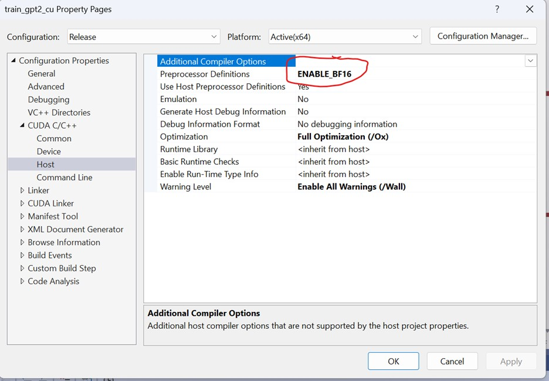
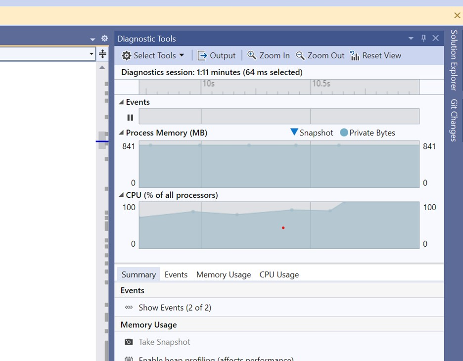

# Windows Support for llm.c

[karpathy/llm.c: LLM training in simple, raw C/CUDA
(github.com)](https://github.com/karpathy/llm.c)

Windows Support for llm.c is split into 2 sections:

-   Makefile support on Windows

-   Visual Studio Environment on Windows - Solution and Project Files

## Windows porting goals:

1.  No source file changes (and no #ifdef's if possible)

2.  If changes are necessary, keep them to a minimum.

Changes needed in the repository for both the Makefile and the Visual
Studio IDE:

-   Files Added: 1 new header file - unistd.h (located in \\dev).
    Instead of the actual unistd.h, the purpose of this file for Windows
    is to serve as a porting header. It has the following code:

    -   The Visual Studio project files add an additional compiler
        switch to point to this header file (/Idev).

    -   clock_getttime -- clock_getttime is a POSIX timer function that
        is not available in Windows, so we added it to the header.

    -   Improvement: we may want to have a \'platform\' directory that
        contains porting source code.

Changes specific to support the Makefile on Windows

-   Added section in the Makefile for the Microsoft CL compiler

Changes specific to support the Visual Studio IDE

-   Files Added -- for Visual Studio IDE users: Visual Studio IDE
    solution and project files (located in \\dev)

-   Note: VS IDE support is currently only in the Windows fork here:
    [rosslwheeler/llm.c: Windows support for llm.c
    (github.com)](https://github.com/rosslwheeler/llm.c)

## Using the LLM.c Makefile in Windows

#### Requirements/Assumptions:

-   You have the latest Visual Studio 2022 v17.9 Community Edition

-   Cuda 12.4.1 SDK (this is optional but highly recommended for
    performance reasons)

-   Python 3 for Windows -- run the latest stable release (3.12.2)

-   Windows 10/11 (tested on Windows 11 and Windows Server 2022)

A Gnu Make compatible win32 Makefile installed. It has been tested with
this:

[Release GNU Make 4.4.1 · maweil/MakeForWindows
(github.com)](https://github.com/maweil/MakeForWindows/releases/tag/v4.4.1)
and Chocolatey's make.exe 4.4.1.

Please follow Andrej's instructions for generating the data files via
Python in his readme located here: [llm.c/README.md at master ·
karpathy/llm.c
(github.com)](https://github.com/karpathy/llm.c/blob/master/README.md).

Make will build everything else. There are Make all and Make clean
commands as well as target specific builds supported. This should run
the same as described in the [llm.c/README.md at master · karpathy/llm.c
(github.com)](https://github.com/karpathy/llm.c/blob/master/README.md).
Remember that the files output on Windows will have the obligatory
\*.exe extension but the commands will be the same -- for example the
GPU quick start should run the same using the below:

pip install -r requirements.txt

python prepro_tinyshakespeare.py

python train_gpt2.py

make train_gpt2fp32cu

train_gpt2fp32cu

This Makefile runs on Windows, Mac and Linux including WSL. So, if you
have a WSL environment on Windows, you can compare the timings etc.
between the two build environments.

The Makefile's GitHub branch is located here:

<https://github.com/rosslwheeler/llm.c/tree/Makefile-windows-support>

this Makefile file will ALSO be maintained in the llm.c main repository
here:

[karpathy/llm.c: LLM training in simple, raw C/CUDA
(github.com)](https://github.com/karpathy/llm.c)

test versions will be in the branch (or similarly named branches) and
the release version will be maintained in the upstream fork.

### CI Support

The file in .github\\workflows\\windows_ci.yml in the branch uses Make
to build the Release (optimization flags set) version of llm.c. When you
push into the repository, it will build all of the targets using Make
and execute one test to confirm functionality.

## Visual Studio IDE Support

#### Requirements/Assumptions:

-   You have the latest Visual Studio 2022 v17.9 Community Edition

-   Cuda 12.4.1 SDK (this is optional but highly recommended for
    performance reasons)

-   Python 3 for Windows -- run the latest stable release (3.12.2)

-   Windows 10/11 (tested 11 and Windows Server 2022)

### Run time modes (Native, OpenMP and Cuda/Nvidia)

-   Native - build on windows (no openmp and no cuda speedup) -- it will
    be slow but can be a good initial debug environment.

-   OpenMP -- great feature (10-20x faster) -- must have **latest** VS
    2022 Community (free) version.

-   Nvidia/Cuda -- quick (100x+ faster) -- Need access to an Nvidia GPU.

### Precision preprocessor flag for the CUDA (cu) builds

There are 3 precision types for the Cuda build:

-   ENABLE_BF16

-   ENABLE_FP16

-   ENABLE_FP32

The default is currently set to BF16 but you can change this value as
shown in the train_gpt2_cu AND test_gpt2_cu projects:

Please make sure and rebuild after changing this preprocessor
definition.

### Git Branch location

To build in Visual Studio with the Solution/Project Files, you will want
to clone the latest branch here:

[rosslwheeler/llm.c at VS-Solution-Project-files
(github.com)](https://github.com/rosslwheeler/llm.c/tree/VS-Solution-Project-files)

After cloning the branch, you'll want to decide if you want to walk
through the code in the debugger (Debug build configuration) or just run
it and check the output (Release build configuration). Visual Studio's
Configuration Manager supports both -- you will want to select one of
these configurations.

### Visual Studio Solution and Project Files

In addition to building the llm.c project via the command line using the
Makefile (see Makefile section), this fork supports the Debug and
Release versions of the Visual Studio Solution and Project files. For
those that aren't that familiar with these two files -- there are
similar to Makefiles that have a graphical view of the configuration in
the IDE. There is one Solution file and 4 Project files:

(location in the dev directory of the repository)

dev\\llm_c.sln

-   dev\\train_gpt2_c.vcxproj

-   dev\\test_gpt2_c.vcxproj

-   dev\\train_gpt2_cu.vcxproj

-   dev\\test_gpt2_cu.vcxproj

The llm_c solution file contains the above 4 project files. Via the UX,
you have fine-grained control over the build parameters, preprocessor
defines, location of files, optimization flags, command line option
control etc.

### Building Debug or Release Versions

The Python tokenization and training steps are configured and
implemented in the train_gpt2_c project as a Custom Build step. It is
done when you run/select "Build Release or Build Debug". You do NOT need
to perform/run those Python steps from your command line as outlined in
the README.md but you can do those steps manually if you prefer. The
custom build step will detect the already built files and not
run/overwrite them.

If you plan on debugging and/or walking through the code, it is
recommended to start with the Debug version. Note: the training speed in
the Debug version/mode is much slower than in Release mode.

If you want to see what the optimal performance is, then select Release
mode in the configuration.

### OpenMP Support in Visual Studio

The performance improvement for enabling OpenMP support is significant
-- around 10 times the speed of the Native version. If you're going to
run the non-Cuda training exectuble, it's recommended to keep this
enabled. There are some interesting changes needed to support OpenMP
5.2.

Notes: OpenMP collapse loops (5.2)

-   There's an existing bug reported to Microsoft

-   Requires a work-around using C++ compilation using the /TP switch.

-   The build uses the /openmp:llvm switch -- do not turn on OpenMP in
    the configuration.

-   We can modify the code that uses the OpenMP pragmas by pulling the
    local variables in the loop above the pragma statement. This would
    allow the build to not require the /TP switch work-around but it is
    a maintenance issue. No issues have been seen with compiling with
    this switch enabled (so far).

Below is a screen shot of the Diagnostic tools in the IDE -- note the
CPU's being at 100 percent. This is OpenMP making use of all of the
threads in your system. Efficient!

### Continuous Integration (CI) support with GitHub Actions

The file in .github\\workflows\\windows_ci.yml uses MSBuild to build the
Release version of llm.c. When you push to the repository, it will run
this CI file and build the project and run one test to confirm
functionality.

### Debugger 

-   You should be able to use Visual Studio's debugger with all of the
    projects

-   You can set breakpoints and walk-thru the code with Visual Studio's
    Debugger.

### Issues/Problems with the Makefile or the Visual Studio IDE files

Feel free to add any issues/comments in the repo:

[rosslwheeler/llm.c: Windows support for llm.c
(github.com)](https://github.com/rosslwheeler/llm.c)

and they will be fixed/addressed. Feel free to submit PR's. Changes will
be merged once they are verified and tested.

-   The Solution and Project files for the "most part" are mostly
    default parameters but remember that if you modify them, it may
    affect your ability to build.

-   Tests were performed running the latest versions (Windows 11, Cuda
    12.4, OpenMP 5.2, Visual Studio 22 17.9) with two Nvidia PCIe cards.

Thanks to Andrej and **everyone** for helping on [karpathy/llm.c: LLM
training in simple, raw C/CUDA
(github.com)](https://github.com/karpathy/llm.c)!
